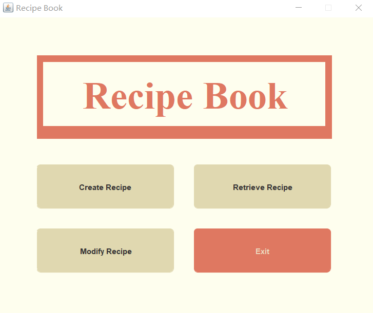
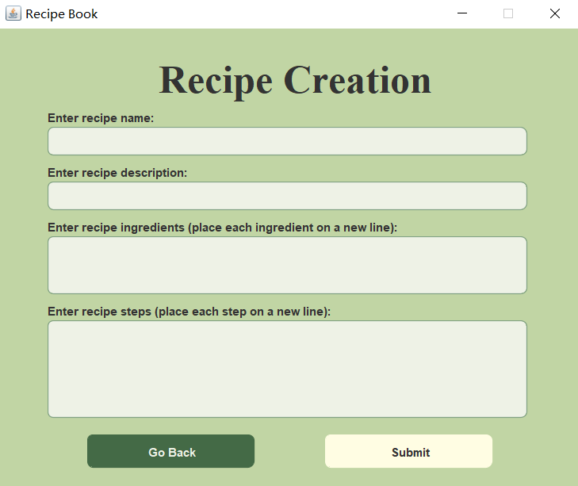
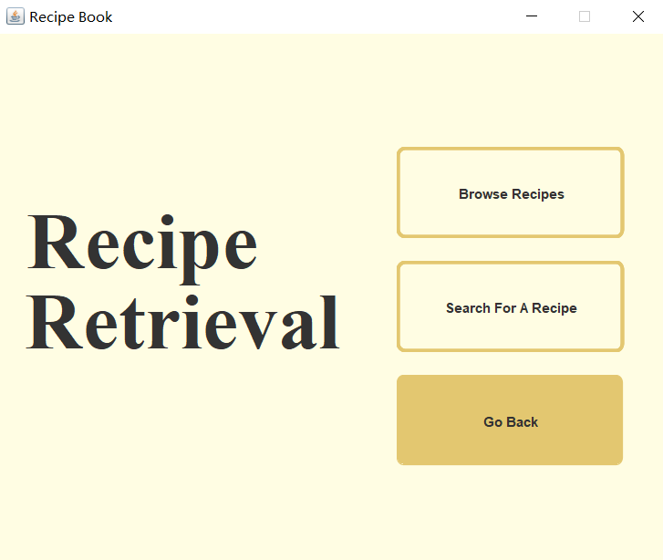
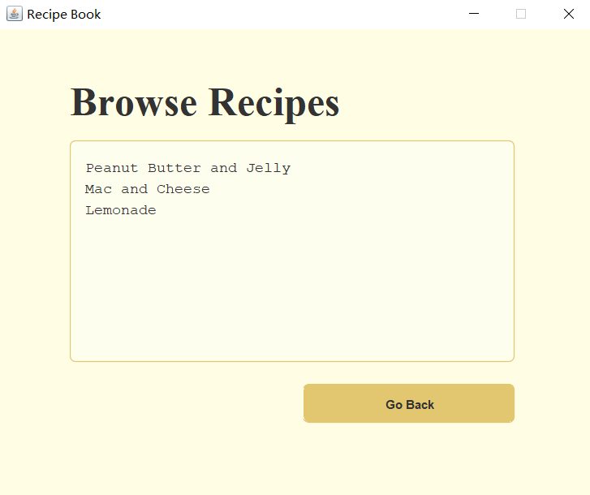
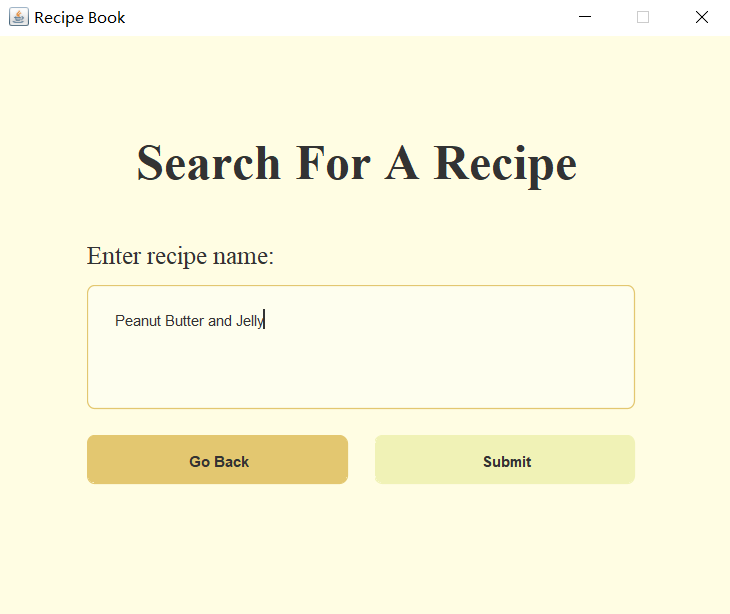
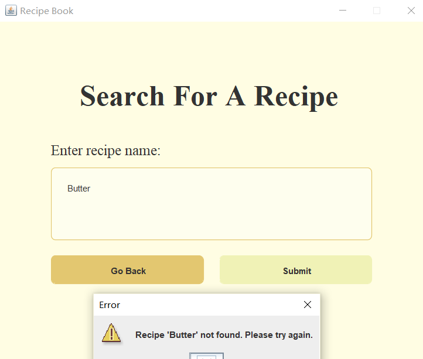
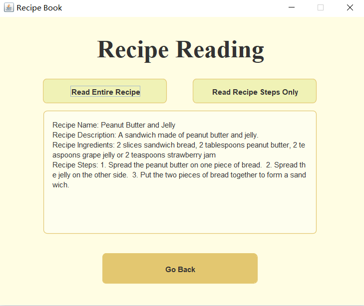
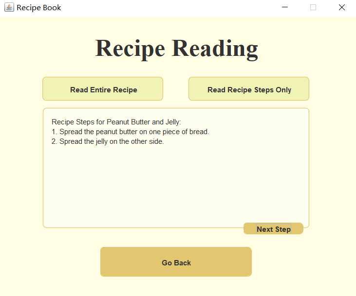
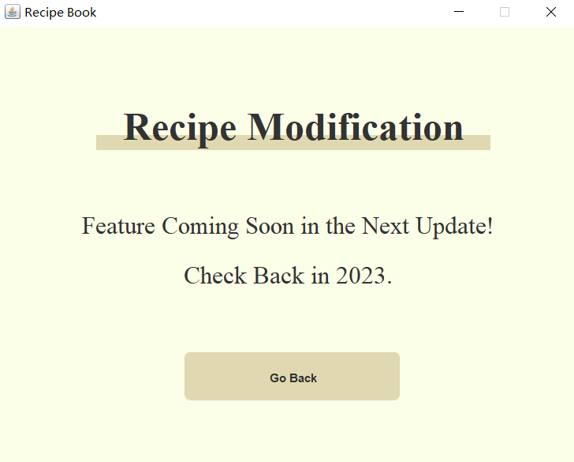

# Hell's Kitchen Recipe Book

In Hell's Kitchen Recipe Book, users are allowed to create new recipes, retrieve pre-existing recipes, and modify pre-existing recipes. 

There are TWO main files which the user can compile: RecipeBook.java and RecipeBookGUI.java. The former is a command-line version of the program, and the latter incorporates a GUI via Java Swing.

## Table of Contents
1. RecipeBook.java
2. RecipeBookGUI.java

### 1. RecipeBook.java
This is a command-line version of the program. The user can compile "RecipeBook.java" and run this file to access this program.

#### Create New Recipe

When the program starts running, it'll first ask if the user wants to create a new recipe, look at the pre-existing recipes, modify a recipe, or exit the program. Here, we'll show an example of the user choosing to create a new recipe.

* When the program asks if the user wants to Create, Retrieve, Modify, or Exit, the user should type `1` in order to <u>start creating a  new recipe</u>.
* Then the program will walk the user through the process of Recipe Creation. The user can type in the Name, Description, Ingredients and Steps, following the instructions given. 
    * Note than when typing the ingredients and steps, the user should press `ENTER` each time an ingredient or a step is typed. When the user has typed in all the ingredients or steps, press `ENTER` twice.
    * The capitalization of the first letter is not required, as the program will do it automatically. 

* Sample of Recipe Creation: 

#### Retrieve Existing Recipes

When the program starts running, it'll first ask if the user wants to create a new recipe, look at the pre-existing recipes, modify a recipe, or exit the program. Here, we'll show an example of the user choosing to retrieving recipes that are already created.

* When the program asks if the user wants to Create, Retrieve, Modify, or Exit, the user should type `2` in order to <u>retrieve and view all the pre-existing recipes</u>.
* Then the program will display a menu including 3 options: browse all recipes, search for a recipe by its exact name, search for a recipe by a partial name, or exit.

##### View all recipes

* To view all the recipes as a list, the user should type `1`. Then, the user can select a recipe out of the ones listed.

##### Search for a recipe

* To view a recipe based on the exact name, the user should type `2.` To view a recipe based on a partial name, the user should type `3.` Let's take a look at the former method.
* It'll ask the user to enter a name of the recipe. If there's a recipe under such name in the database, it will be displayed. 
    * The user can choose the display mode of the recipe, either <u>viewing all steps at once</u> or <u>view it step by step</u>.

###### View all steps

###### View the recipe step by step

#### Modify a recipe
When the program starts running, it'll first ask if the user wants to create a new recipe, look at the pre-existing recipes, modify a recipe, or exit the program. Here, we'll show an example of the user choosing to modify a recipe that is already created.

* To modify a recipe the user should type `3.` The user has the option of changing a recipe or deleting it altogether.

###### Changing a recipe
* The user selects the recipe they would like to change. Then, they enter in the new information for the recipe. If there is something they don't want to change, they can leave the field blank. Let's take a look at an example where we change the name of "Mac and Cheese" to "Spicy Mac and Cheese."

###### Deleting a recipe
* The user selects the recipe they would like to delete.

#### Exit

* In the end, the user can type `4` to <u>exit the interface.</u>

### 2. RecipeBookGUI.java
This is a GUI version of the program which was made using Java Swing. It has mostly the same features as the command-line version except the modify features have not been added. The user can compile "RecipeBookGUI.java" and run this file to access this program.

#### Recipe Book Page

When the program starts the user has the same 4 options: Create Recipe, Retrieve Recipe, Modify Recipe, or Exit.

#### Create Recipe Page

The "Create Recipe" page features text fields where the user can submit a new recipe or go back to the main page.

#### Retrieve Recipe Page

The "Retrieve Recipe" page features three buttons which allow the user to browse all recipes, search for a recipe, or go back to the main page. 

#### Browse Recipe Page

The "Retrieve Recipe" page lists all the recipe names currently in the recipe book and a button that allows the user to go back to the main page. 

#### Search For A Recipe Page
The "Search For A Recipe" page allows the user to look up a recipe. It also has a button that allows the user to go back to the "Retrieve Recipe" page. 

* If the recipe is found, the user is taken to the "Recipe Reading" page.

* If the recipe is not found, the user gets a pop-up error message.

#### Recipe Reading page

The "Recipe Reading" page allows the user to read a recipe in two ways: read the entire recipe or read its instructions step by step. It also has a button that allows the user to go back to the "Retrieve Recipe" page. 

* The user can click "Read Entire Recipe" to see the whole recipe.

* The user can click "Read Recipe Steps Only" to read the instructions for the selected recipe step by step. A "Next Step" button appears at the button. When clicking on it, the user can see the next step.

#### Recipe Modification

The "Recipe Modification" page will be implemented in the next update!

#### Exit
Finally, the user can click "Exit" on the main page or the "X" in the corner to close the program.

