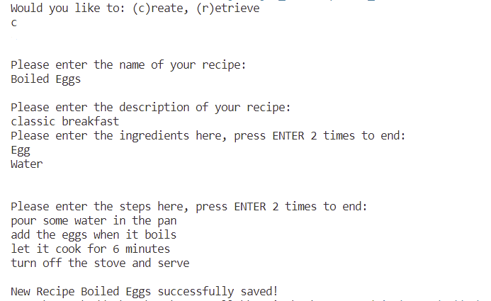
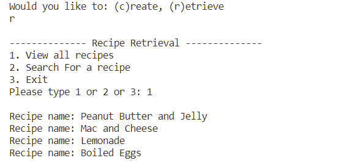
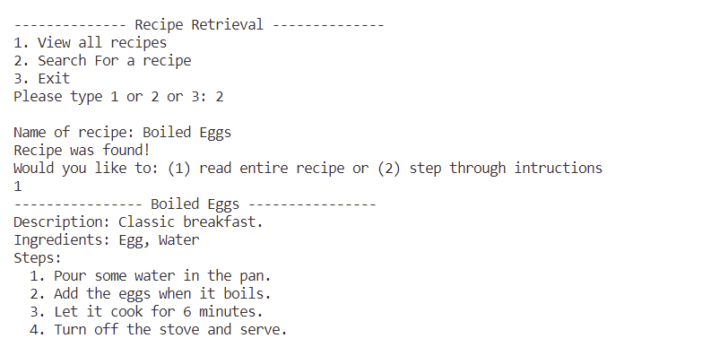
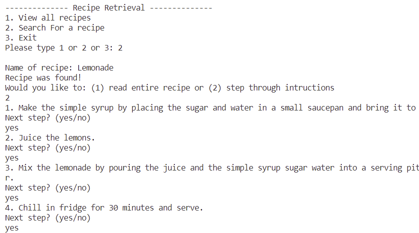
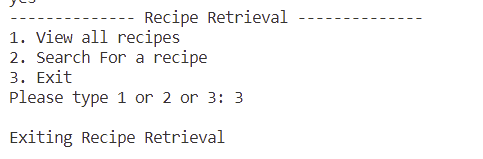

# Hell's Kitchen Recipe Book

In Hell's Kitchen Recipe Book, users are allowed to create new recipes or retrieve pre-existing recipes.

## Create New Recipe

When the program starts running, it'll first ask if the user wants to create a new recipe or have a look on the pre-existing recipes in the recipe book. Here, we'll show an example of the user choosing to create a new Recipe.

* When the program asks if the user wants to Create or Retrieve, the user should type `c` in order to <u>start creating a  new recipe</u>.
* Then the program will walk the user through the process of Recipe Creation. The user can type in the Name, Description, Ingredients and Steps, following the instructions given. 
    * Note than when typing the ingredients and steps, the user should press  `ENTER` each time an ingredient or a step is typed. When the user has typed in all the ingredients or steps, press `ENTER` twice.
    * The capitalization of the first letter is not required, as the program will do it automatically. 

* Sample of Recipe Creation: 

## Retrieve Existing Recipes

When the program starts running, it'll first ask if the user wants to create a new recipe or have a look on the pre-existing recipes in the recipe book. Here, we'll show an example of the user choosing to retrieving recipes that are already created.

* When the program asks if the user wants to Create or Retrieve, the user should type `r` in order to <u>retrieve and view all the pre-existing recipes</u>.
* Then the program will display a menu including 3 options: view all recipes as a list, view a specific recipe, or exit.

### View all recipes

* To view all the recipes as a list, the user should type `1`.

### Search for a recipe

* To view a specific recipe, the user should type `2`
* It'll ask the user to enter a name of the recipe. If there's a recipe under such name in the database, it will be displayed. 
    * The user can choose the display mode of the recipe, either <u>viewing all steps at once</u> or <u>view it step by step</u>.

#### View all steps

#### View the recipe step by step

### Exit

* In the end, the user can type `3` to <u>exit the interface.</u>

